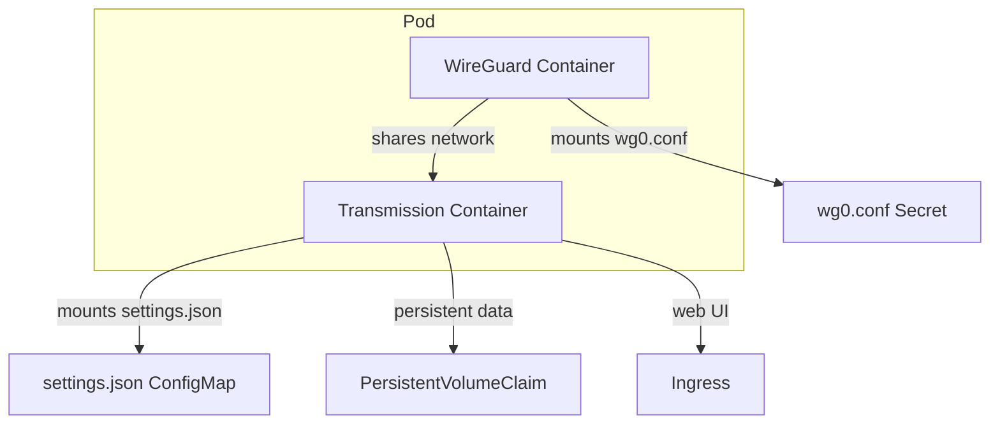

# transmission-wireguard Architecture

- Both containers run in a single Pod for forced VPN routing.
- WireGuard config is provided via Secret or values.
- Transmission settings are provided via ConfigMap.
- Data is persisted via PVC or hostPath.
- Ingress is optional for exposing the web UI.
